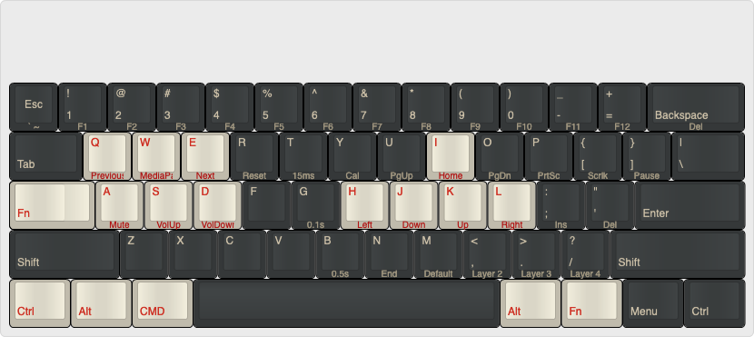

# POK3R keyboard layouts for Windows and OSX
For those who don't know what a POK3R keyboard is, this is a decent [review](https://www.youtube.com/watch?v=8wjW-Or1jg8).
Multiple sources to buy, e.g. [amazon](http://smile.amazon.com/Mechanical-Keyboard-Keycaps-Cherry-Mx-Blue/dp/B00OFM51L2/), [mechanicalkeyboards.com](https://mechanicalkeyboards.com/shop/index.php?l=product_detail&p=1233)

## General POK3R programming info
* [POK3R User Manual](files\POK3R.User.Manual.V1.5.pdf); Vortex keeps shifting their URLs, so local copy (thanks @couto, @josephfusco)
* Factory reset: Hold both the left and right `ALT` keys
* Reset selected layer only: `FN + R` until LED under spacebar stops flashing

## Layer 2 (Red) for OSX:

OSX Layout on [keyboard-layout-editor.com](http://www.keyboard-layout-editor.com/##@_name=Pok3r%20Layer%202%20for%20OSX%2F%2FMac&notes=See%20%5Bgithub%5D(https%2F:%2F%2F%2F%2Fgithub.com%2F%2Fthyandrecardoso%2F%2Fpok3r-layouts%C2%A0%C2%A0%C2%A0%C2%A0)%3B&@_y:1.5&c=%233c4041&t=%23aba18b&p=DCS&a:7%3B&=Esc%0A%0A%0A%0A%60%20~&_a:4%3B&=!%0A1%0A%0A%0AF1&=%2F@%0A2%0A%0A%0AF2&=%23%0A3%0A%0A%0AF3&=$%0A4%0A%0A%0AF4&=%25%0A5%0A%0A%0AF5&=%5E%0A6%0A%0A%0AF6&=%2F&%0A7%0A%0A%0AF7&=*%0A8%0A%0A%0AF8&=(%0A9%0A%0A%0AF9&=)%0A0%0A%0A%0AF10&=%2F_%0A-%0A%0A%0AF11&=+%0A%2F=%0A%0A%0AF12&_w:2%3B&=%0ABackspace%0A%0A%0ADel%3B&@_w:1.5%3B&=%0ATab&_c=%23c7c3b5&t=%23ba1312%3B&=Q%0A%0A%0A%0APrevious&=W%0A%0A%0A%0AMediaPause&=E%0A%0A%0A%0ANext&_c=%233c4041&t=%23aba18b%3B&=R%0A%0A%0A%0AReset&=T%0A%0A%0A%0A15ms&=Y%0A%0A%0A%0ACal&=U%0A%0A%0A%0APgUp&_c=%23c7c3b5&t=%23ba1312%3B&=I%0A%0A%0A%0AHome&_c=%233c4041&t=%23aba18b%3B&=O%0A%0A%0A%0APgDn&=P%0A%0A%0A%0APrtSc&=%7B%0A%5B%0A%0A%0AScrlk&=%7D%0A%5D%0A%0A%0APause&_w:1.5%3B&=%7C%0A%5C%3B&@_c=%23c7c3b5&t=%23ba1312&w:1.25&w2:1.75%3B&=%0AFn&_x:0.5%3B&=A%0A%0A%0A%0AMute&=S%0A%0A%0A%0AVolUp&=D%0A%0A%0A%0AVolDown&_c=%233c4041&t=%23aba18b%3B&=F&=G%0A%0A%0A%0A0.1s&_c=%23c7c3b5&t=%23ba1312%3B&=H%0A%0A%0A%0ALeft&=J%0A%0A%0A%0ADown&=K%0A%0A%0A%0AUp&=L%0A%0A%0A%0ARight&_c=%233c4041&t=%23aba18b%3B&=%2F:%0A%2F%3B%0A%0A%0AIns&=%22%0A'%0A%0A%0ADel&_w:2.25%3B&=%0AEnter%3B&@_w:2.25%3B&=%0AShift&=Z&=X&=C&=V&=B%0A%0A%0A%0A0.5s&=N%0A%0A%0A%0AEnd&=M%0A%0A%0A%0ADefault&=%3C%0A,%0A%0A%0ALayer%202&=%3E%0A.%0A%0A%0ALayer%203&=%3F%0A%2F%2F%0A%0A%0ALayer%204&_w:2.75%3B&=%0AShift%3B&@_c=%23c7c3b5&t=%23ba1312&w:1.25%3B&=%0ACtrl&_w:1.25%3B&=%0AAlt&_w:1.25%3B&=%0ACMD&_c=%233c4041&t=%23aba18b&p=DCS%20SPACE&a:7&w:6.25%3B&=&_c=%23c7c3b5&t=%23ba1312&p=DCS&a:4&w:1.25%3B&=%0AAlt&_w:1.25%3B&=%0AFn&_c=%233c4041&t=%23aba18b&w:1.25%3B&=%0AMenu&_w:1.25%3B&=%0ACtrl)

## Sources
The how-to for these mappings is from 2 reddit threads:
* [r/mk: HowTo program pok3r](http://www.reddit.com/r/MechanicalKeyboards/comments/35uy60/guide_howto_program_your_pok3r_programming_layers/)
* [r/mk: HowTo media controls pok3r](http://www.reddit.com/r/MechanicalKeyboards/comments/37j3sx/guide_modification_pok3r_media_volume_controls_hw/)
 
 This work is licensed under a <a rel="license" href="http://creativecommons.org/licenses/by-sa/4.0/">Creative Commons Attribution-ShareAlike 4.0 International License</a>.
